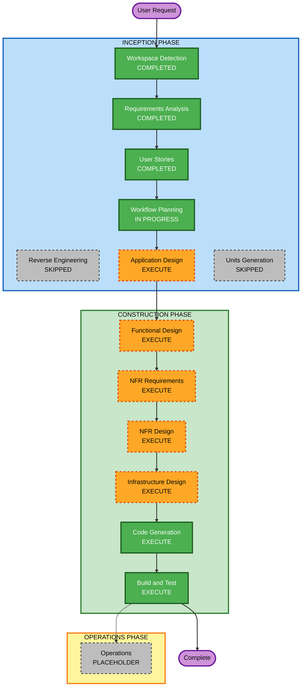

# Execution Plan — Customer Orders REST API

## Detailed Analysis Summary

### Change Impact Assessment
- **User-facing changes**: Yes — new customer-facing REST API with full CRUD, auth, and order lifecycle
- **Structural changes**: Yes — greenfield service with new data model, auth layer, and serverless deployment
- **Data model changes**: Yes — new Order schema with items, status lifecycle, shipping, payment
- **API changes**: Yes — 7 new REST endpoints + 1 auth endpoint
- **NFR impact**: Yes — JWT auth, input validation, structured logging, rate limiting, MongoDB indexes

### Risk Assessment
- **Risk Level**: Medium
- **Rollback Complexity**: Easy (greenfield — no existing system to break)
- **Testing Complexity**: Moderate (unit + integration + e2e + PBT with fast-check)

---

## Workflow Visualization



### Text Alternative

```
INCEPTION PHASE
  [x] Workspace Detection     — COMPLETED
  [-] Reverse Engineering     — SKIPPED (greenfield)
  [x] Requirements Analysis   — COMPLETED
  [x] User Stories            — COMPLETED
  [>] Workflow Planning       — IN PROGRESS
  [ ] Application Design      — EXECUTE
  [-] Units Generation        — SKIPPED (single unit)

CONSTRUCTION PHASE (single unit)
  [ ] Functional Design       — EXECUTE
  [ ] NFR Requirements        — EXECUTE
  [ ] NFR Design              — EXECUTE
  [ ] Infrastructure Design   — EXECUTE
  [ ] Code Generation         — EXECUTE (always)
  [ ] Build and Test          — EXECUTE (always)

OPERATIONS PHASE
  [-] Operations              — PLACEHOLDER
```

---

## Phases to Execute

### INCEPTION PHASE
- [x] Workspace Detection — COMPLETED
- [-] Reverse Engineering — SKIPPED (greenfield, no existing code)
- [x] Requirements Analysis — COMPLETED
- [x] User Stories — COMPLETED
- [>] Workflow Planning — IN PROGRESS
- [ ] Application Design — **EXECUTE**
  - **Rationale**: New service with new components (auth middleware, order controller, order service, repository layer). Component boundaries and service layer design need definition before code generation.
- [-] Units Generation — **SKIPPED**
  - **Rationale**: Single deployable unit (one Lambda-backed API service). No decomposition into multiple units needed.

### CONSTRUCTION PHASE (single unit: `orders-api`)
- [ ] Functional Design — **EXECUTE**
  - **Rationale**: New Order data model, status lifecycle rules, totalAmount computation, and IDOR authorization logic need detailed design. PBT-01 requires property identification here.
- [ ] NFR Requirements — **EXECUTE**
  - **Rationale**: Performance targets, security requirements (15 SECURITY rules), PBT framework selection (PBT-09), and tech stack finalization needed.
- [ ] NFR Design — **EXECUTE**
  - **Rationale**: NFR patterns must be incorporated — JWT middleware, input validation (Zod/Joi), rate limiting, structured logging, MongoDB indexing strategy.
- [ ] Infrastructure Design — **EXECUTE**
  - **Rationale**: AWS Lambda + API Gateway + MongoDB Atlas + Secrets Manager + CloudWatch need explicit mapping. SECURITY-01, SECURITY-06, SECURITY-07 require infrastructure-level design.
- [ ] Code Generation — **EXECUTE** (always)
  - **Rationale**: Generate all application code, tests (unit + integration + e2e + PBT), and IaC.
- [ ] Build and Test — **EXECUTE** (always)
  - **Rationale**: Build instructions, test execution, CI/CD pipeline setup.

### OPERATIONS PHASE
- [-] Operations — PLACEHOLDER (future deployment and monitoring workflows)

---

## Success Criteria
- **Primary Goal**: Fully functional Customer Orders REST API deployable to AWS Lambda
- **Key Deliverables**:
  - 8 REST endpoints (POST /auth/login + 7 order endpoints)
  - JWT auth middleware with object-level authorization
  - MongoDB persistence with Mongoose ODM
  - Full test suite: unit + integration + e2e + property-based (fast-check)
  - AWS SAM or Serverless Framework IaC
  - All 15 SECURITY rules compliant
  - All applicable PBT rules compliant (full enforcement)
- **Quality Gates**:
  - All tests passing
  - No hardcoded secrets
  - Security compliance summary clean
  - PBT compliance summary clean
